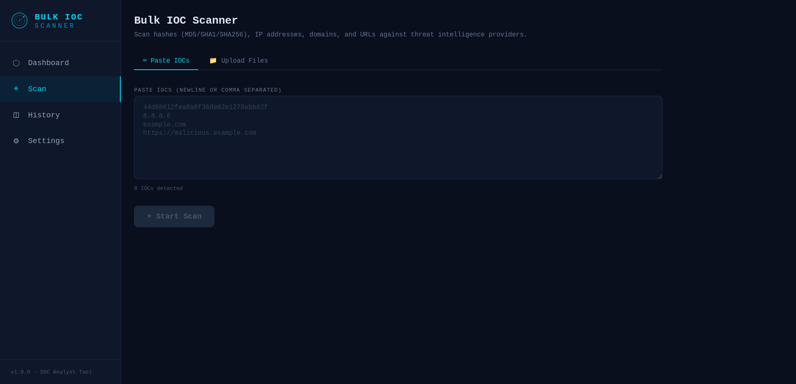

# Bulk-IOC-Scanner

Paste a list of indicators — file hashes, IPs, domains, URLs — and get them all
checked against threat intelligence sources at once, with a risk score, a
history you can search, and reports you can copy straight into a ticket.

It runs on your own machine. Nothing is uploaded except the indicators
themselves, and files you scan are hashed locally so only the hash ever leaves
your computer.



---

## Install

Pick **one** of the three. All of them give you the same app at
`http://localhost:8000`.

<table>
<tr>
<th>Option</th><th>Best for</th><th>Needs</th>
</tr>
<tr>
<td><a href="#option-1-download-and-run">Download and run</a></td>
<td>The quickest start, no tools to install</td>
<td>Nothing</td>
</tr>
<tr>
<td><a href="#option-2-install-with-pipx-or-uvx">pipx / uvx</a></td>
<td>Keeping it updated, macOS users</td>
<td>Python 3.11+</td>
</tr>
<tr>
<td><a href="#option-3-docker">Docker</a></td>
<td>Servers, shared team instances</td>
<td>Docker</td>
</tr>
</table>

### Option 1: Download and run

Grab the file for your system from the
[latest release](https://github.com/HashemSalhi/Bulk-IOC-Scanner/releases/latest).

**Windows** — download `bulk-ioc-scanner-windows-x64.exe` and double-click it.

> Windows will warn you the app is unrecognised, because the file is not code
> signed. Click **More info**, then **Run anyway**.

**Linux** — download `bulk-ioc-scanner-linux-x64`, then:

```bash
chmod +x bulk-ioc-scanner-linux-x64
./bulk-ioc-scanner-linux-x64
```

**macOS** — there is no prebuilt Mac app; use [pipx](#option-2-install-with-pipx-or-uvx)
or [Docker](#option-3-docker) instead.

### Option 2: Install with pipx or uvx

Needs Python 3.11 or newer.

```bash
pipx install bulk-ioc-scanner
bulk-ioc-scanner
```

Or run it without installing anything permanently:

```bash
uvx bulk-ioc-scanner
```

<details>
<summary>Getting pipx</summary>

| System | Command |
|---|---|
| Windows | `py -m pip install --user pipx` then `py -m pipx ensurepath` |
| macOS | `brew install pipx` then `pipx ensurepath` |
| Debian / Ubuntu / Kali | `sudo apt install pipx` then `pipx ensurepath` |
| Fedora | `sudo dnf install pipx` then `pipx ensurepath` |

Close and reopen your terminal after `ensurepath`.
</details>

To update later: `pipx upgrade bulk-ioc-scanner`

### Option 3: Docker

```bash
docker run -d --name bulk-ioc-scanner \
  -p 8000:8000 \
  -v bulk-ioc-scanner-data:/data \
  ghcr.io/hashemsalhi/bulk-ioc-scanner:latest
```

Then open `http://localhost:8000`. Your history and keys live in the
`bulk-ioc-scanner-data` volume and survive upgrades.

Or, from a copy of this repository, `docker compose up -d`.

---

## First run

1. Start it. A browser tab opens at `http://localhost:8000` on its own.
2. Go to **Scan**, paste your indicators — one per line, or comma separated —
   and press Scan.
3. Results appear as they arrive. Click any row for the full per-source
   breakdown, tag it, add notes, or copy a formatted report.

Defanged indicators are fine: `8[.]8[.]8[.]8` and `hxxps://evil[.]com` are
understood and cleaned up automatically.

You can also drop files in. They are hashed on your machine and only the
SHA-256 is sent out — the file contents never leave.

### About API keys

**You do not need any API key to start.** RDAP/WHOIS works immediately and
covers IPs, domains, and network ownership.

For hashes and URLs you will want at least one key. They are free, take about a
minute, and go in the **Settings** page inside the app — there is no config file
to edit.

| Source | What it adds | Free key |
|---|---|---|
| RDAP / WHOIS | Registrar, domain age, network owner | Not needed |
| VirusTotal | Multi-vendor verdicts for hashes, IPs, domains, URLs | [virustotal.com](https://www.virustotal.com/gui/my-apikey) |
| AbuseIPDB | IP abuse reports and confidence score | [abuseipdb.com](https://www.abuseipdb.com/account/api) |
| GreyNoise | Tells internet background noise from targeted activity | [greynoise.io](https://viz.greynoise.io/account/api-key) |
| ThreatFox | Known malware indicators from abuse.ch | [auth.abuse.ch](https://auth.abuse.ch/) |
| URLScan.io | Existing scans and screenshots of a URL | [urlscan.io](https://urlscan.io/user/profile/) |
| IPify | Geolocation and ASN for an IP | [geo.ipify.org](https://geo.ipify.org/docs) |

Any source without a key is skipped. You can switch individual sources on and
off on the Settings page.

---

## Where your data is kept

Scan history and API keys go in one folder, outside the program itself, so
upgrading or reinstalling never loses them:

| System | Folder |
|---|---|
| Windows | `%LOCALAPPDATA%\BulkIOCScanner` |
| macOS | `~/Library/Application Support/BulkIOCScanner` |
| Linux | `~/.local/share/bulk-ioc-scanner` |
| Docker | the `/data` volume |

To **back up**, copy `bulk_ioc_scanner.db` out of that folder. To **start
clean**, delete it. To keep it somewhere else, start with
`bulk-ioc-scanner --data-dir "D:\cases\ioc-data"`.

The database contains your API keys in plain text and is created readable only
by your user account. Treat a copy of it the way you would treat the keys.

---

## On a corporate network

If your organisation routes traffic through a proxy or inspects TLS, scans will
fail until it is told how to get out. Everything below can go in a `.env` file
in your data folder, or be set as environment variables.

**Behind a proxy** — the standard variables are picked up automatically:

```bash
HTTPS_PROXY=http://proxy.example.corp:8080
NO_PROXY=localhost,127.0.0.1
```

To force one regardless of the environment, set `PROXY_URL` instead.

**TLS inspection** — if your company issues its own certificates, point the app
at the CA bundle:

```bash
CA_BUNDLE=/path/to/corporate-ca.pem
```

If you already have `REQUESTS_CA_BUNDLE`, `SSL_CERT_FILE`, or `CURL_CA_BUNDLE`
set for curl or pip, those are used automatically and you need to do nothing.

**Slow links** — raise the timeouts:

```bash
REQUEST_TIMEOUT_SECONDS=60
CONNECT_TIMEOUT_SECONDS=20
```

Rate limits are handled for you: a source that answers "too many requests" is
retried with a growing delay and then paced more slowly, and a source that is
down or blocked only costs you its own column — the rest of the scan finishes
normally.

> As a last resort you can set `INSECURE_SKIP_VERIFY=true` to stop checking
> certificates. Prefer `CA_BUNDLE`; skipping verification means you cannot tell
> your proxy from an attacker.

---

## Troubleshooting

| Problem | Fix |
|---|---|
| **Windows: "Windows protected your PC"** | Click **More info** → **Run anyway**. The file is unsigned, not malicious. |
| **The browser did not open** | Go to `http://localhost:8000` yourself. The address is printed in the terminal. |
| **"Port 8000 is in use"** | Nothing to do — it moves to the next free port and tells you which. Or pick one: `--port 9000`. |
| **Linux: "cannot execute binary file"** | Run `chmod +x bulk-ioc-scanner-linux-x64` first. |
| **Linux: a GLIBC version error** | Your distribution is older than the build. Use pipx or Docker instead. |
| **`pipx: command not found`** | Run `pipx ensurepath`, then close and reopen your terminal. |
| **Every scan fails with a connection error** | You are probably behind a proxy — see [On a corporate network](#on-a-corporate-network). |
| **"certificate verify failed"** | TLS inspection. Set `CA_BUNDLE` to your organisation's certificate. |
| **A hash comes back "no active provider"** | Only RDAP is on, and it does not do hashes. Add a VirusTotal key on the Settings page. |
| **"invalid API key"** | Re-paste the key on the Settings page; keys are easy to truncate when copying. |
| **Scans are slow** | Free tiers are rate limited — VirusTotal allows 4 lookups a minute. Repeat scans of the same indicator are served from a 24-hour cache. |
| **The page is blank** | Hard-refresh with Ctrl+Shift+R (Cmd+Shift+R on a Mac). |

Still stuck? Open an [issue](https://github.com/HashemSalhi/Bulk-IOC-Scanner/issues)
with what you ran and what you saw.

---

## Options

```
bulk-ioc-scanner [--host HOST] [--port PORT] [--no-browser]
                 [--data-dir PATH] [--log-level LEVEL] [--version]
```

`--host 0.0.0.0` makes it reachable from other machines. There is no login
screen, so only do that on a network you trust.

---

## Uninstall

| Installed with | Remove the app | Remove your data |
|---|---|---|
| Download | Delete the downloaded file | Delete the [data folder](#where-your-data-is-kept) |
| pipx | `pipx uninstall bulk-ioc-scanner` | Delete the [data folder](#where-your-data-is-kept) |
| Docker | `docker rm -f bulk-ioc-scanner` | `docker volume rm bulk-ioc-scanner-data` |

---

## Contributing

Working on the code is covered in [DEVELOPMENT.md](DEVELOPMENT.md).

## License

[MIT](LICENSE).
